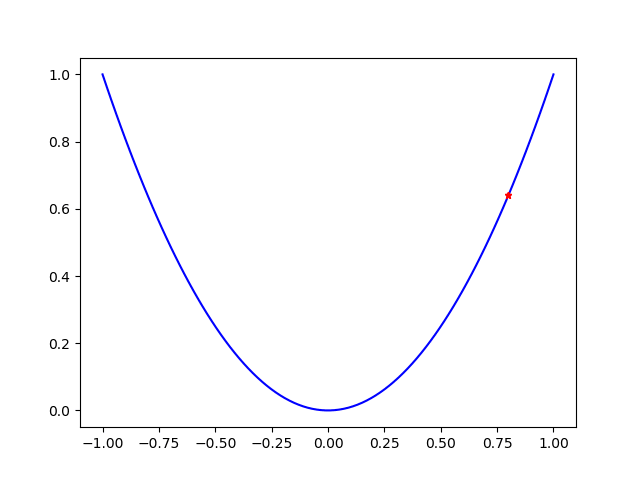
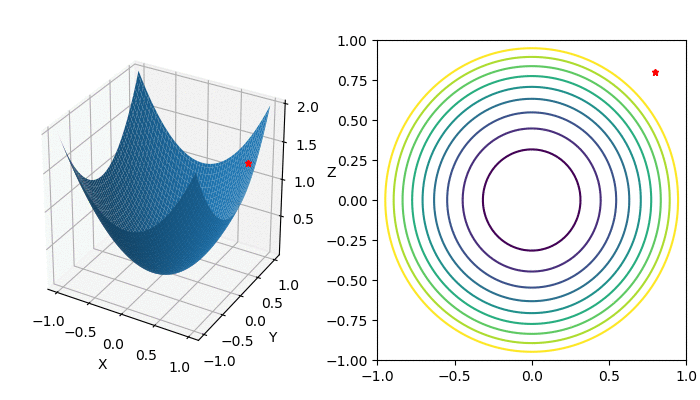
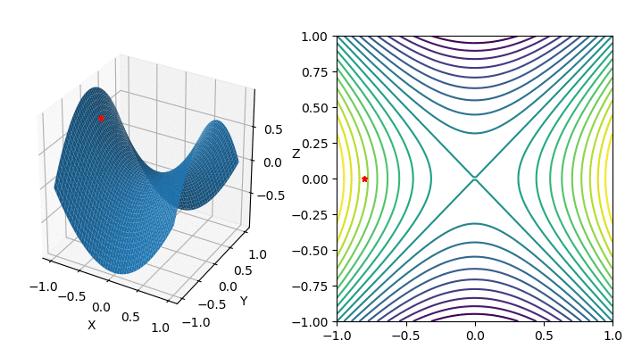
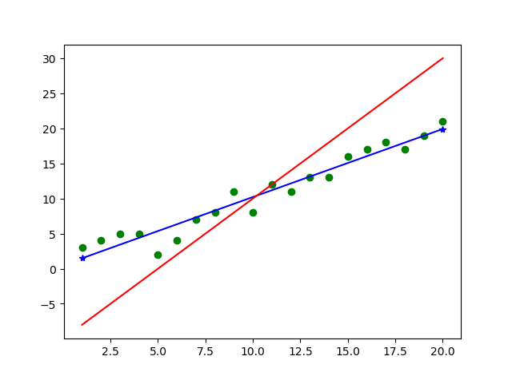

# 梯度下降法

梯度下降法演示。

 - `y=x^2`

 - `z=x^2+y^2`

 - `z=x^2-y^2`

 - 线性回归
 

# 参考文章
 - [理解梯度下降法](https://mp.weixin.qq.com/s/lqwUkimO4irkIZmAnp0bcg)
 - [深入浅出--梯度下降法及其实现](https://www.jianshu.com/p/c7e642877b0e)
