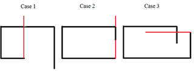

## Self Crossing
You are given an array x of n positive numbers. You start at point (0,0) and moves x[0] metres to the north, then x[1] metres to the west, x[2] metres to the south, x[3] metres to the east and so on. In other words, after each move your direction changes counter-clockwise.

Write a one-pass algorithm with O(1) extra space to determine, if your path crosses itself, or not.

 - Example 1:

```
Given x = [2, 1, 1, 2],
┌───┐
│   │
└───┼──>
    │
Return true (self crossing)
```

 - Example 2:

```
Given x = [1, 2, 3, 4],
┌──────┐
│      │
│
│
└────────────>
Return false (not self crossing)
```

 - Example 3:

```
Given x = [1, 1, 1, 1],
┌───┐
│   │
└───┼>
Return true (self crossing)
```

## Code



不交叉的有以下三种情况：
 - 平行移动的距离是不断的增加的（螺旋形上升）
 - 平行移动的距离是不断的减少的（螺旋形下降）
 - 平行移动的距离先增加后减少，并且再也不增加

交叉情况：
 - 减小后增大
 - 成矩形
