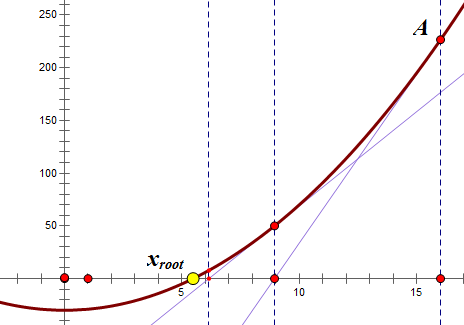

Implement int sqrt(int x).

Compute and return the square root of x.

x is guaranteed to be a non-negative integer.


Example 1:

```
Input: 4
Output: 2
```

Example 2:

```
Input: 8
Output: 2
Explanation: The square root of 8 is 2.82842..., and since we want to return an integer, the decimal part will be truncated.
```

## Code
说下牛顿迭代法：



求n的平方根，即有`x^2 = n`，即求`f(x) = x^2 - n`与x轴的交点；

对任一点`x = a`，f(x)在a的斜率为`f'(a) = 2a`；

过点`(a, f(a))`，斜率为`2a`的直线，与x轴的交点为`x = (a + n/a) / 2`；

重复以上过程。

